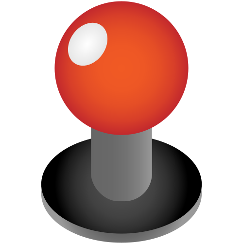

<br>
# Smart Joystick
<i>A smart joystick plugin</i> <br>
### Version 2.0.1.1

[](https://github.com/skymen/better-joystick/releases/download/skymen_smartJoystick-2.0.1.1.c3addon/skymen_smartJoystick-2.0.1.1.c3addon)
<br>
<sub> [See all releases](https://github.com/skymen/better-joystick/releases) </sub> <br>

---
<b><u>Author:</u></b> skymen <br>
<sub>Made using [CAW](https://marketplace.visualstudio.com/items?itemName=skymen.caw) </sub><br>

## Table of Contents
- [Usage](#usage)
- [Examples Files](#examples-files)
- [Properties](#properties)
- [Actions](#actions)
- [Conditions](#conditions)
- [Expressions](#expressions)
---
## Usage
To build the addon, run the following commands:

```
npm i
npm run build
```

To run the dev server, run

```
npm i
npm run dev
```

## Examples Files

---
## Properties
| Property Name | Description | Type |
| --- | --- | --- |
| Texture | Click to edit the object's texture. | link |
| Size | Click to set the object to the same size as its image. | link |
| Touch Event | What to do on touch start and touch end | combo |
| Initial State | If Fade, decides if the joystick starts visible or not. | combo |
| Mode | None behaves like a regular joystick. Smart follows the handle if it gets too far. Spawn spawns the joystick if clicked anywhere within the radius then behaves like a regular joystick. | combo |
| Radius | Only if smart or spawn. Decides the radius in which the joystick gets triggered anyway. | float |
| Use Mouse Input | Whether to use mouse input or only touch input | combo |
| Fade time | Only if Touch event is set to fade. The time is in milliseconds. | integer |


---
## Actions
| Action | Description | Params
| --- | --- | --- |
| Bind Handle | Bind Handle | Handle             *(object)* <br> |
| Set Touch Event | Set Touch Event | Event             *(combo)* <br> |
| Set Mode | Set Mode | Mode             *(combo)* <br> |
| Set Radius | Set radius | Radius             *(number)* <br> |


---
## Conditions
| Condition | Description | Params
| --- | --- | --- |
| Is dragging | True when the joystick is used |  |
| On drag start | Triggered when the joystick starts being used |  |
| On drag end | Triggered when the joystick stops being used |  |


---
## Expressions
| Expression | Description | Return Type | Params
| --- | --- | --- | --- |
| JoystickAngle | Returns the joystick's angle | number |  | 
| JoystickDirX | Returns the joystick's X displacement | number |  | 
| JoystickDirY | Returns the joystick's Y displacement | number |  | 
| JoystickDistance | Returns the joystick's distance | number |  | 
| JoystickForce | Returns the joystick's force | number |  | 
| JoystickForceX | Returns the joystick's X force | number |  | 
| JoystickForceY | Returns the joystick's Y force | number |  | 
| JoystickRadius | Returns the joystick's radius | number |  | 
| JoystickX | Returns the joystick's X position | number |  | 
| JoystickY | Returns the joystick's Y position | number |  | 
